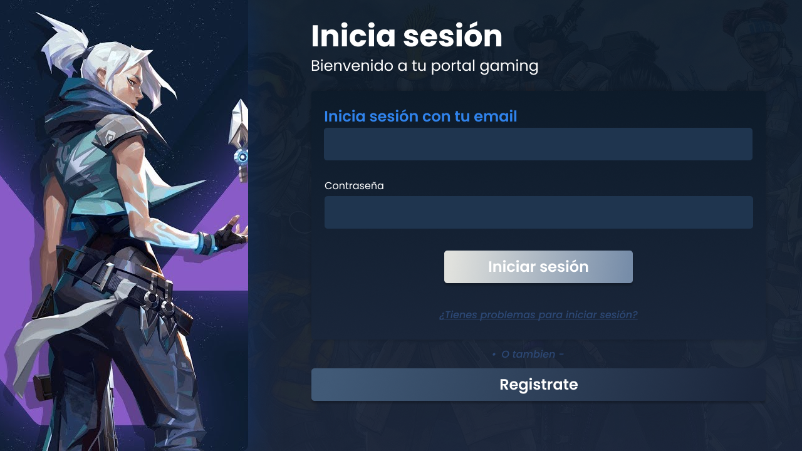

# Practicando Front
Este repositorio tiene como objetivo mi práctica de programador Front-end... Primero utilizare HTML y CSS vanilla, posteriormente recreare las mismas vistas
usando React.

## Tecnologias usadas de momento:
1. HTML
2. CSS

### Contexto del proyecto
Gideon Gaming tiene como proposito ser una plataforma en donde los usuarios puedan subir sus mejores jugadas en sus videojuegos

___

## Intención de recreación

Estado: Completado.

